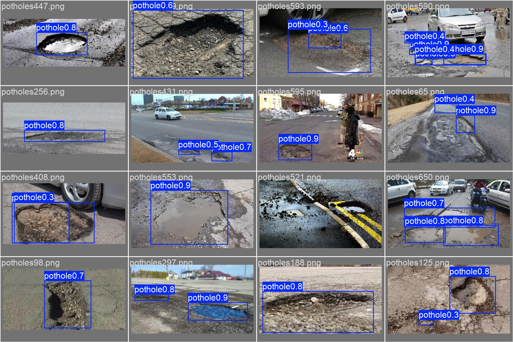
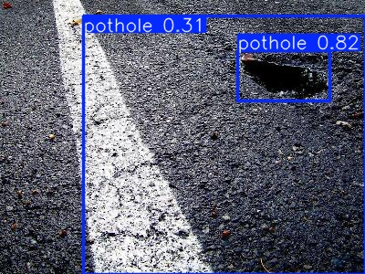
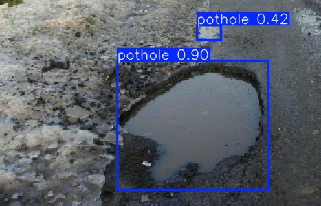
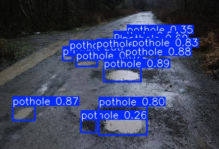
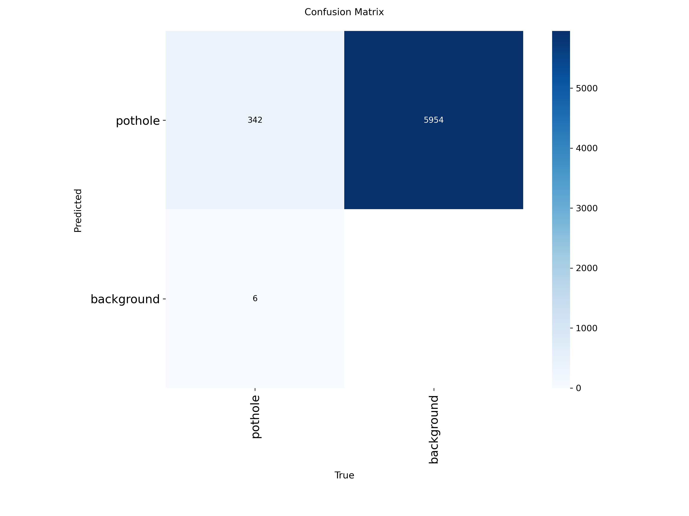

# Road Damage Detection using YOLOv8
[](https://road-damage-detection-yolov8-5zpqzf4ayqnlnnhh5bvnf9.streamlit.app/)

> **Live Demo:** Upload a road image and run the trained YOLOv8 model to detect visible potholes and view detection confidence scores.

A computer vision system for detecting **potholes in road-surface images** using the YOLOv8 object detection architecture.

The project explores how deep learning can be used to automatically identify road defects from images, supporting faster road-condition assessment and infrastructure monitoring.

## Project Overview

Manual road inspection can be slow, expensive, and difficult to scale.

This project applies object detection to road imagery in order to automatically identify visible road-surface damage.

The system was developed using **YOLOv8**, with model training, image augmentation, validation, and visual inference evaluation.

## Model

The project uses:

- **YOLOv8n**
- 30 training epochs
- Transfer learning
- Custom road-damage dataset
- Data augmentation
- Object detection evaluation using mAP

YOLOv8n was selected because it provides a lightweight architecture suitable for efficient experimentation and deployment.

## Dataset

The dataset contains annotated road-damage images divided into:

- **Training images:** 532
- **Validation images:** 133

The images contain examples of damaged road surfaces used to train the object detection model.

## Data Augmentation

Several augmentation techniques were applied to improve model robustness:

- Blur
- Median Blur
- Grayscale transformation
- CLAHE (Contrast Limited Adaptive Histogram Equalization)

These transformations help expose the model to different image-quality and lighting conditions.

## Model Performance

The trained YOLOv8 model achieved approximately:

| Metric | Score |
|---|---:|
| mAP@50 | 0.8218 |
| mAP@50–95 | 0.5346 |
The final evaluation was performed on **133 validation images containing 348 annotated pothole instances**.

Additional validation statistics:

- Precision: **0.846**
- Recall: **0.725**
- mAP@50: **82.18%**
- mAP@50–95: **53.46%**

These results demonstrate the model's ability to detect road-surface damage across the validation dataset.

## Detection Results

### Validation Predictions

The model was evaluated on the held-out validation set and produced bounding-box predictions for potholes across road-surface images.



### Example Pothole Detections

Below are example detections generated by the trained YOLOv8 model.







### Confusion Matrix

The confusion matrix provides an additional view of the detector's classification performance on the validation set.



## Project Workflow

The computer vision pipeline follows:

```text
Road Images
     ↓
Image Annotation
     ↓
Dataset Preparation
     ↓
Data Augmentation
     ↓
YOLOv8 Training
     ↓
Validation
     ↓
Damage Detection
     ↓
Visual Predictions
